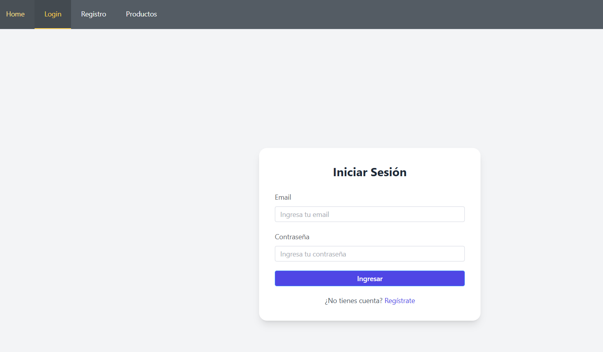
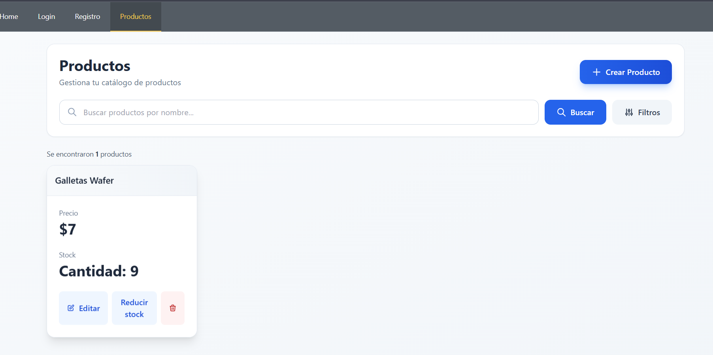
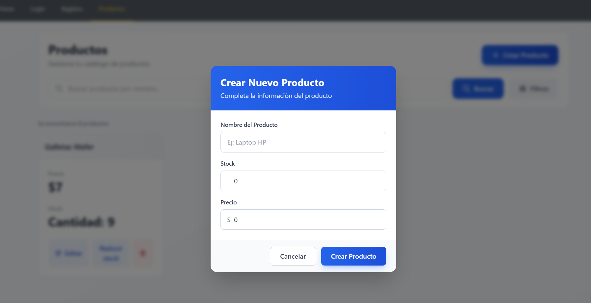
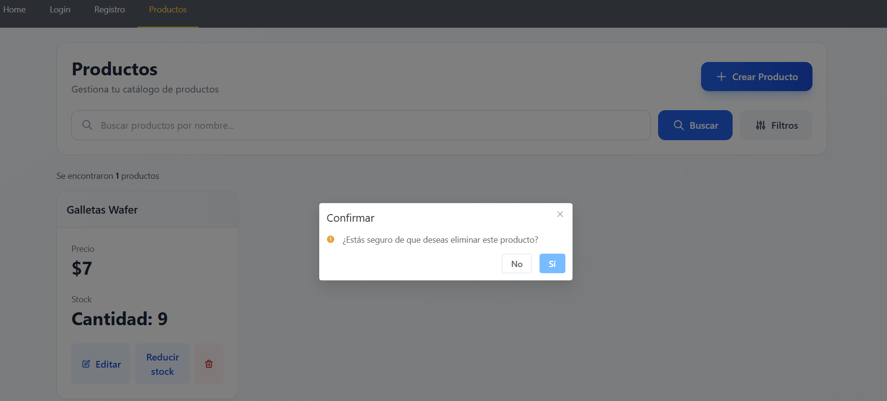

# Administracion de productos


## Fast API Backend

Descripcion, sobre que es el proyecto.

Un servidor con CRUD de productos, usuarios, y categorias, para la administracion de productos.

## Vue JS Frontend


Descripcion, 


## Estructura del proyecto (Opcional)

```
fastapi-backend
    - rotes
    - test
        - user
vuejs-frontend
    - src
        - components
           - icons 

```

## Tecnologias

- Python 3.12
- Fast API
- SqlLite
- VueJS
- Javascript
- Tailwind


## Requerimientos

- Ram 2 Gb
- 500 Mb
- Procesador Core i3 7ma Gen o equivalente
- Docker
- Python instalado


## Pasos de instalacion

1. Clonar repositorio
 
```
 git@github.com:DaynorTito/FastAPI-VueJS-Project.git
```

2. Instalar las dependencias

2.1 Dependencias del Backend

Acceder al folder carpeta fastapi-backend

Crear el ambiente virtual

```
python -m venv
```

Activar ambiente virtual de Python

```
.\venv\Scripts\activate
```
Instalo dependencias

```
pip install
```

2.2 Dependencias del Frontend

Acceder al folder carpeta vuejs-frontend

Ejejcutar el comando de instalacion

```
npm install
```

3. Ejecutar los proyectos

3.1 Ejeuctar Backend
Acceder al folder carpeta fastapi-backend

ejecuar el comando

```
uvicorn main:app --reload
```

3.2 Ejecutar Frontend

Acceder al folder carpeta vuejs-frontend

Ejejcutar el comando de ejecucion

```
npm run dev
```

## Las funciones de mi proyecto

1. Registrar usuarios


Un usuario puede registrarse ingresando el nombre,apellido, email, password.

Todos estos campos son obligatorios

2. Login de usuarios 




Un usuario puede loguearse con sus credeciales, creadas en el formulario de registro.

3. Listado de productos



Un usuario logueado puede listar sus productos.

4. Creacion de nuevos productos




Un usuario logueado, pued ecrear nuevos productos, ingresando el nombre,stock y precio del producto.

5. Alertas a bajo stock



Cuando el stock se encuentra menos del umbral, se envia un correo electronico, indicando esta situacion, con datos del producto.


